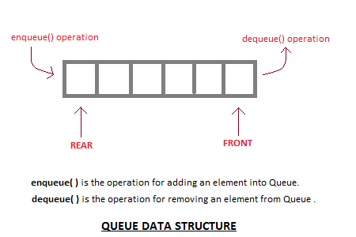
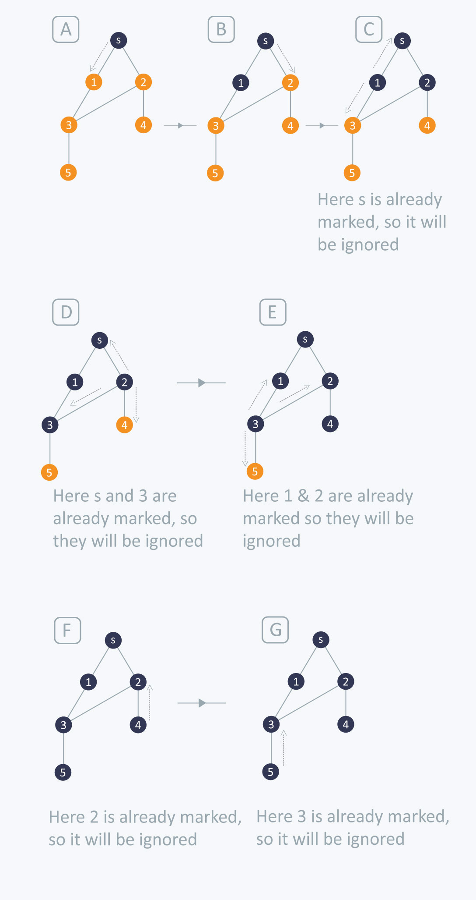

###Graphs and BFS
In this tutorial we will be studying the abstract graph data structure. Graphs can be used to solve many real world problems. In our modern world that relies on connections and networks, graphs are used to represent systems of roads, internet connections, and even the list of classes required to graduate.

###What are we aiming to cover?
Learn about the components of a graph and how they form the graph data structure.
Learn to represent graphs through adjacency matrix and adjacency linkedList
Implement graph and apply the popular graph algorithms Breadth First Search and the Queue data structures associated with it.


###What are the parts that comprise a graph?

###Vertex:
A graph's vertex(a node) is a fundamental part of the graph it can have a name which is called the "key" a vertex might also have additional information which is called the "payload".

###Edge:
The edge connects two vertices and represents information about the relationship between them. There are two types of edges one-way(directed) or two-way(undirected). A graph with one-way edges is a directed graph in which you can only move in one direction from node to node.A graph with two-way edges is an undirected graph in which moving from node to node is bidirectional.

###Weight:
Edges may sometimes have weight showing that there is a cost to go from a vertex to the connected vertex. A weighted graph might represent a road map.

###Path:
A path is a sequence of vertices and edges from one vertex to another. A weighted path is the sum of all weighted edges covered between two vertices.

###Cycle:
A cycle exists in a Directed graph, it is a path that starts and ends from the same vertex.

Below is an example of a weighted directed graph with 6 vertices you can imagine this portraying the flight distances between major cities.


One way to implement a graph is to use a 2D matrix. The rows and columns represents a vertex in the graph. And values correspond to the weighted edge connecting the two vertices. The simple grid layout makes it easy to see which vertices are associated with which, but a constraint for using the adjacency matrix is that it is cumbersome when applied to large graph structures with many vertices.


Real world graphs often times are "loosely connected" meaning their associated adjacency matrix is sparsely populated because the number of edges per vertex is nowhere near every other vertex.
A more space efficient way to implement a loosely connected graph data structure is by using an adjacency List.


In an adjacency list, a master list of all vertices in the graph is kept and each vertex maintains a list of vertices it's edges are connected to. Easy to represent a sparse graph while displaying all links to a particular vertex.

###What is a common algorithm used to traverse a graph data structure?

Breadth first search is a common algorithm but before we dive into it we must first understand the Queue abstract data type that breadth first search implements.

###What is a Queue?
a queue is an ordered collection of items where adding new items occurs at one end (rear) and the removal of items occurs at the other end (front). This ordering strategy is called FIFO, first in first out. A simpler way of understanding it would be with the phrase "first come first served!". A real world comparison to a queue would be lining up to make a purchase, as people are drawn up at the register your position in the queue slowly makes it's way to the front.



The queue data type holds the operations of Dequeue() Enqueue() dequeue() isEmpty() and size(). Not only is it implemented in Breadth First Search in graphs but also with dynamic arrays and linked lists.

```Python
class Queue(object):
    def __init__(self):
      self.items = []

    def Dequeue(self):                #remove item from front!
      self.items.pop()

    def Enqueue(self, item):          #add item to the Rear
      self.items.insert(0, item)

    def size(self):
      return len(self.items)

    def isEmpty(self):
      return self.items = []

```

###What is Breadth First Search?
Okay say we have a graph and we want to visit every single node. Breadth First Search(BFS) is an algorithm for traversing graphs starting from a selected starting node and exploring layer wise. By exploring the starting nodes neighbors breadth first search doesn't move to the next layer until all neighbors are explored from the current node. It implements a Queue to store the visited nodes. Below is the code implementation of BFS. The boolean visited in the Node class lets BFS mark each node as it searches the graph.

```Python
class Node(object):
    def __init__(self, name):
      self.name = name
      self.adjacencyList = []
      self.visited = False

def BFS(self, startNode):
    q = Queue()              #initializes Queue
    q.Enqueue(startNode)   #places root node into Queue
    startNode.visited = True     #sets startNode as visited

    while q:                    #while q is not empty
      currentNode = q.Dequeue()   #current node to check it's neighbors
      for n in currentNode.adjacencyList:   #loop neighbors
        if not n.visited:
          n.visited = True
          q.append(n)                   #add neighbors to q
```




In the diagram above the graph traversal begins at the root node "s" and push "s" into the Queue. Root node "s" will then be popped off the queue.

current Queue contents [s] to []
"s" neighbors node 1 and node 2 will then be traversed and pushed in the queue and marked as visited.
[2,1]

node 1 will be popped from the Queue and it's neighbors will be traversed and placed into the queue if they have not been visited.
node 3 will be marked as visited and pushed into the queue.
[3,2]
and so on.

Following this general pattern each node's neighbors will be explored before proceeding to the Neighbor's neighbors due to the nature of using a Queue.
